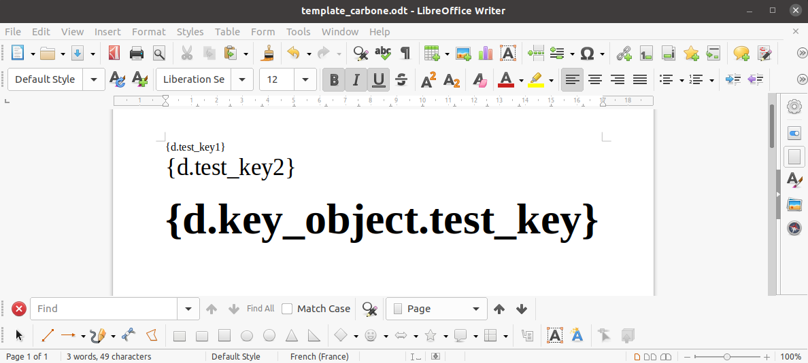
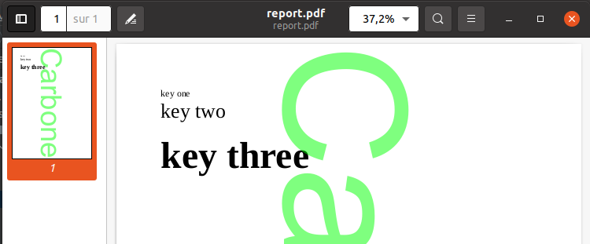

# api-carbone-client

## 0 - install dependencies

add this to your project's pom.xml : 

```
<dependencies>
    <groupId>tennaxia.carboneio</groupId>
    <artifactId>api-carbone-client</artifactId>
    <version>1.0.0</version>
</dependencies>
```

## 1 - initialize API services

To initialize your services, you need to instantiate CarboneIOServices with your product key token and version :

```
CarboneIOServices carboneServices = new CarboneIOServices(token, version)
```

## 2 - Using API

now with the instantiated object you can use all carbone.io services :


### 2.1 upload template

You need to send the template file content in byte[], it will return an `Optional` containing templateId if upload is successful.

```java
Path testFilePath = Paths.get("template_carbone.odt");
Optional<String> templateId = service.addTemplate(Files.readAllBytes(testFilePath));
```




### 2.2 render report

You can now render your report with a Json like object (refer to carbone.io documentation for syntax details):

```java
public class MyJsonObject {
    String test_key1;
    String test_key2;
    MyKeyObj key_object;

    public MyJsonObject(String test_key1, String test_key2, String inner_test_key) {
        this.test_key1 = test_key1;
        this.test_key2 = test_key2;
        this.key_object = new MyKeyObj(inner_test_key);
    }
    
    private static class MyKeyObj {
        String test_key;

        private MyInnerObj(String test_key) {
            this.test_key = test_key;
        }
    }
}
```

then calling render with template id :

```java
MyJsonObject jsonObj = new MyJsonObject("key one", "key two", "key three");
/**
 *  {
 *      test_key1 : "key one",
 *      test_key2 : "key two",
 *      key_object : {
 *          test_key : "key three"
 *      }
 **/

String renderId = carboneServices.renderReport(jsonObj, templateId.get());
```
By default rendered report will be in pdf format and with option UseLosslessCompression at false
You can also call render with additional option for pdf rendering (see : [pdf Format Options](https://carbone.io/api-reference.html#pdf-export-filter-options))
To do so, you need to extend CarboneFormatOptions the add attributes matching options (case sensitive)

```java
String renderId = carboneServices.renderReport(jsonObj, templateId.get(), additionalOptions);
```

### 2.3 download report

you can now download your report :

```java
File outputFile = new File("report.pdf");

try (FileOutputStream outputStream = new FileOutputStream(outputFile)) {
    outputStream.write(carboneServices.getReport(renderId));
}
```

